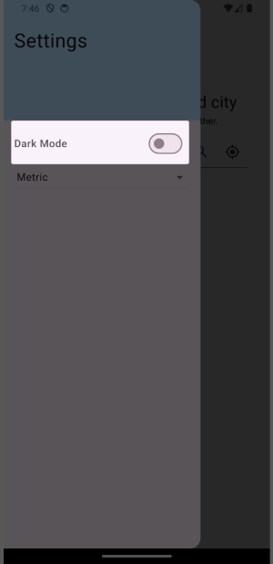
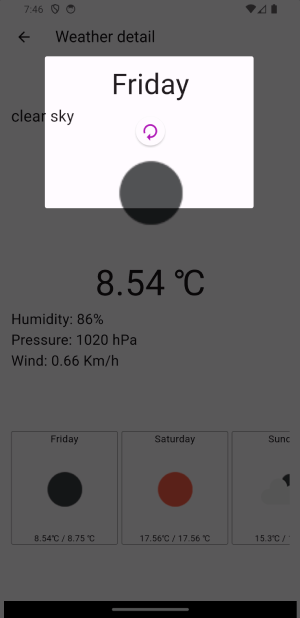

# Weather application

A new and easy way to know about the daily forcast

## Getting Started

Introducing FlutterWeather, your all-in-one weather companion designed to keep you informed and stylish in any forecast. This sleek and intuitive weather application seamlessly combines functionality with a modern and user-friendly interface, offering a range of features to enhance your weather-checking experience.

## City Weather Search:
With FlutterWeather, staying updated on the weather in your favorite cities has never been easier. Simply input the name of the city you're interested in, and the app provides you with real-time weather conditions, temperature, humidity, wind speed, and more. Stay ahead of the weather game, whether you're planning a trip or just curious about the conditions in a specific location.

## Current Location Weather Search:
Never be caught off guard by the weather again. FlutterWeather automatically detects your current location, delivering instant weather updates tailored to your surroundings. Receive accurate and up-to-the-minute information, ensuring you're prepared for whatever Mother Nature has in store.

## Theme Customization:
Personalize your weather experience with FlutterWeather's theme customization options. Choose between a light and dark theme, allowing you to adapt the app's appearance to your preference and lighting conditions. Whether you prefer a sleek and minimalistic look during the day or a more subdued, night-friendly interface, FlutterWeather has you covered.

## Degree Units Selection:
Tailor the weather data to your preferred degree units. FlutterWeather lets you effortlessly switch between Celsius and Fahrenheit, ensuring that the temperature is displayed in the format that makes the most sense to you. Stay in control of your weather information with this convenient customization feature.

## Pull to Refresh:
Stay connected to the latest weather updates by simply pulling down on the screen. FlutterWeather's intuitive pull-to-refresh feature ensures that you have the most recent weather information at your fingertips. Whether you're tracking a developing storm or just want the latest conditions, refreshing is as easy as a swipe.

## Tests:

This project contains tests for Blocs and widgets, You see them inside the test folder

